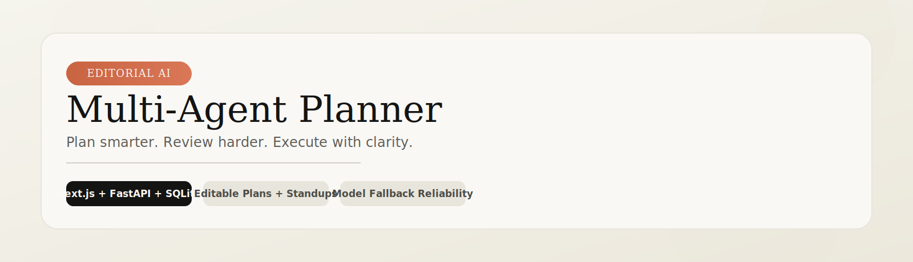

<p align="center">
    
</p>

<p align="center">
    
    
    
    
</p>

<p align="center">
    A warm, editorial planning system that turns one goal into a realistic roadmap you can edit, re-review, and execute.
</p>

<p align="center">
    <a href="#quick-start">Quick Start</a> ·
    <a href="#architecture">Architecture</a> ·
    <a href="#api-surface">API Surface</a> ·
    <a href="#service-guides">Service Guides</a>
</p>

---

## Why This Feels Different

Most planners stop at generation. Multi-Agent Planner stays useful during execution.

| Stage | What You Get | Why It Matters |
|---|---|---|
| Plan | Multi-step roadmap from one goal | Fast first draft |
| Review | Dedicated reviewer pass | Better realism and sequencing |
| Edit | Manual task refinement | Human control where it counts |
| Operate | Standups, status flow, history | Day-to-day execution clarity |

This documentation suite follows the language and visual direction in `DESIGN.md`.

## Architecture

```text
┌───────────────────────────────────────────────────────────────────────────────┐
│                           MULTI-AGENT PLANNER FLOW                           │
└───────────────────────────────────────────────────────────────────────────────┘

┌──────────────────────────────┐      POST /generate-plan       ┌──────────────────────────────┐
│ Frontend                     │ ──────────────────────────────> │ AI Service                   │
│ Next.js 16 + React 19        │      POST /re-review-plan      │ FastAPI                      │
│ http://localhost:3000        │ ──────────────────────────────> │ http://localhost:8000        │
│                              │      POST /daily-standup       │                              │
└───────────────┬──────────────┘ ──────────────────────────────> └──────────────┬──────────────┘
                                │                     reviewed plan + standup                   │
                                │ <───────────────────────────────────────────────────────────── │
                                │                                                               │ POST /api/plans
                                │ PATCH /api/tasks/:id                                          │
                                ▼                                                               ▼
┌──────────────────────────────┐      read/write plans + tasks   ┌──────────────────────────────┐
│ Task API                     │ ───────────────────────────────> │ SQLite planner.db            │
│ Express + TypeScript         │ <─────────────────────────────── │ task-api/data/planner.db     │
│ http://localhost:4000        │           query results          │                              │
└──────────────────────────────┘                                  └──────────────────────────────┘
```

## Stack Snapshot

| Layer | Stack | Responsibility |
|---|---|---|
| Frontend | Next.js 16 + React 19 | Goal capture, task editing, standup and history UI |
| AI Service | FastAPI + provider fallback chain | Planner/reviewer orchestration and normalization |
| Task API | Express + TypeScript + SQLite | Durable storage and task lifecycle updates |

## Repository Map

```text
multi-agent-planner/
├─ ai-service/      FastAPI planner/reviewer orchestration
├─ task-api/        Express + SQLite persistence API
├─ frontend/        Next.js planning studio UI
├─ DESIGN.md        Design language and writing direction
└─ README.md
```

## Quick Start

### Prerequisites

- Node.js 20+
- Python 3.10+
- npm 10+

### 1) Create local env files

```powershell
Copy-Item ai-service/.env.example ai-service/.env
Copy-Item task-api/.env.example task-api/.env
Copy-Item frontend/.env.example frontend/.env.local
```

Add provider keys in `ai-service/.env`.

### 2) Install dependencies

```powershell
python -m venv ai-service/venv
ai-service/venv/Scripts/python.exe -m pip install -r ai-service/requirements.txt
npm install --prefix task-api
npm install --prefix frontend
```

### 3) Run all services (three terminals)

Terminal A:

```powershell
npm run dev --prefix task-api
```

Terminal B:

```powershell
cd ai-service
venv/Scripts/python.exe -m uvicorn main:app --reload --port 8000
```

Terminal C:

```powershell
npm run dev --prefix frontend
```

Open http://localhost:3000.

<details>
    <summary><strong>One-command build validation checklist</strong></summary>

```powershell
npm run build --prefix task-api
npm run build --prefix frontend
python -m compileall ai-service
```

</details>

## API Surface

| Service | Endpoint | Purpose |
|---|---|---|
| AI Service | `POST /generate-plan` | Build and review the initial task roadmap |
| AI Service | `POST /re-review-plan` | Critique manually edited tasks |
| AI Service | `POST /daily-standup` | Summarize done, in-progress, and blocked work |
| Task API | `POST /api/plans` | Persist plan and task graph |
| Task API | `GET /api/plans/:id` | Fetch one plan with tasks |
| Task API | `PATCH /api/tasks/:id` | Update mutable task fields |
| Task API | `DELETE /api/plans/:id` | Delete one plan and related tasks |

## Service Guides

| Service | Guide |
|---|---|
| AI Service | [ai-service/README.md](ai-service/README.md) |
| Task API | [task-api/README.md](task-api/README.md) |
| Frontend | [frontend/README.md](frontend/README.md) |

## Troubleshooting

- If Python imports fail, run commands with `ai-service/venv/Scripts/python.exe`.
- If plan persistence falls back locally, verify Task API on `http://localhost:4000`.
- If the frontend appears stale, restart Next.js and hard refresh the browser.
