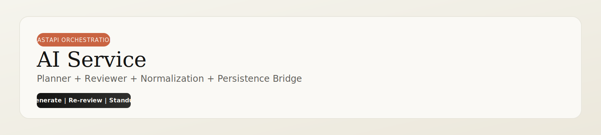

<p align="center">
        
</p>

<p align="center">
        
        
        
</p>

<p align="center">
        <a href="#quick-start">Quick Start</a> ·
        <a href="#processing-pipeline-clean-ascii">Pipeline</a> ·
        <a href="#endpoints">Endpoints</a> ·
        <a href="#output-contract">Output Contract</a>
</p>

---

The AI Service is the orchestration brain of the platform: it plans, critiques, normalizes, and forwards final plans for storage.

## Service Snapshot

| Stage | Responsibility | Output |
|---|---|---|
| Plan | Build initial task graph from goal | candidate task list |
| Review | Critique realism and missing steps | revised task list + summary |
| Normalize | Apply guardrails and schema safety | stable payload |
| Persist | Send final plan to Task API | durable plan record |

## Processing Pipeline (Clean ASCII)

```text
┌───────────────┐      ┌───────────────┐      ┌───────────────┐
│ Goal Input    │ ---> │ Planner Agent │ ---> │ Reviewer Agent│
└───────────────┘      └───────┬───────┘      └───────┬───────┘
                                fallback chain          revised tasks
                                        \               /
                                         \             /
                                          ▼           ▼
                                  ┌──────────────────────────┐
                                  │ Normalization Layer      │
                                  │ - schema safety          │
                                  │ - task count guardrail   │
                                  │ - recommended date fill  │
                                  └────────────┬─────────────┘
                                               │
                                               ▼
                                  POST /api/plans (Task API)
```

## Endpoints

| Method | Endpoint | Purpose |
|---|---|---|
| `POST` | `/generate-plan` | Generate and review an initial plan |
| `POST` | `/re-review-plan` | Re-review manually edited tasks |
| `POST` | `/daily-standup` | Summarize done, in-progress, and blocked work |

## Environment Variables

Create local env file:

```powershell
Copy-Item .env.example .env
```

| Variable | Required | Description |
|---|---|---|
| `GROQ_API_KEY` | Yes | Primary provider key |
| `OPENROUTER_API_KEY` | Yes | Fallback provider key |
| `OPENROUTER_SITE_URL` | No | OpenRouter referer metadata |
| `OPENROUTER_APP_NAME` | No | OpenRouter app-name metadata |

## Quick Start

From repository root:

```powershell
python -m venv ai-service/venv
ai-service/venv/Scripts/python.exe -m pip install -r ai-service/requirements.txt
cd ai-service
venv/Scripts/python.exe -m uvicorn main:app --reload --port 8000
```

Open docs at http://localhost:8000/docs.

## Output Contract

Each task emitted downstream includes:

- `task_id`
- `title`
- `description`
- `estimated_hours`
- `priority`
- `status`
- `dependencies`
- `recommended_date`

## Reliability Notes

- If model output is malformed, the service normalizes or fills safe defaults.
- If Task API persistence fails, the service returns a local fallback plan response.

## Key Files

- `main.py`: endpoints, normalization rules, and persistence bridge.
- `agents/planner.py`: planner prompts and provider fallback logic.
- `agents/reviewer.py`: reviewer prompts and provider fallback logic.
- `.env.example`: configuration template.
