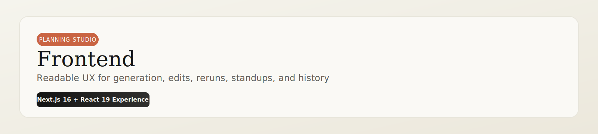

<p align="center">
    
</p>

<p align="center">
    
    
    
</p>

<p align="center">
    <a href="#setup--run">Quick Start</a> ·
    <a href="#ui-flow-clean-ascii">UI Flow</a> ·
    <a href="#feature-highlights">Features</a> ·
    <a href="#integration-endpoints">Endpoints</a>
</p>

---

This is the planning studio experience: a warm, editorial dashboard for generating plans, refining tasks, and tracking execution momentum.

## Experience Snapshot

| Interaction | User Value |
|---|---|
| Goal + constraints input | Better planning context from day one |
| Editable task cards | Human control over generated output |
| Reviewer rerun | Fast quality pass on manual edits |
| Standup + history panels | Better daily execution visibility |

## UI Flow (Clean ASCII)

```text
┌─────────────────────────────────────────────────────────────────────────┐
│                     Frontend (http://localhost:3000)                   │
└─────────────────────────────────────────────────────────────────────────┘

┌──────────────────────────────┐      POST /generate-plan      ┌──────────────────────────────┐
│ Goal + Constraints Form      │ ─────────────────────────────> │ AI Service (:8000)           │
│ deadline + priority controls │      POST /re-review-plan     │ planner/reviewer endpoints    │
└───────────────┬──────────────┘ ─────────────────────────────> └──────────────────────────────┘
                                │
                                │ PATCH /api/tasks/:id
                                ▼
┌──────────────────────────────┐
│ Editable Task Cards          │
│ status, fields, dependencies │
└───────────────┬──────────────┘
                                │
                                │ local UI slices
                                ▼
┌──────────────────────────────┐
│ history, standup, trace      │
│ print/export-safe rendering  │
└──────────────────────────────┘
```

## Feature Highlights

- Goal brief with optional deadline and priority controls.
- Progressive generation phases: planning, reviewing, finalizing.
- Inline task editing with Task API persistence.
- Reviewer rerun for edited task graphs.
- Daily standup summary for done, active, and blocked items.
- In-session plan history snapshots.
- PDF export via print-safe layout.

## Tech Stack

- Next.js 16
- React 19
- TypeScript
- Framer Motion
- Lucide
- Tailwind CSS
- Axios

## Environment Variables

Create local env file:

```powershell
Copy-Item .env.example .env.local
```

| Variable | Required | Description |
|---|---|---|
| `NEXT_PUBLIC_AI_SERVICE_URL` | Yes | Base URL for AI Service |
| `NEXT_PUBLIC_TASK_API_URL` | Yes | Base URL for Task API including `/api` |

## Setup & Run

From repository root:

```powershell
npm install --prefix frontend
npm run dev --prefix frontend
```

Open http://localhost:3000.

## Build Commands

```powershell
npm run build --prefix frontend
npm run start --prefix frontend
```

## Important Files

- `src/app/page.tsx`: planner workflow, edit state, and integration calls.
- `src/app/globals.css`: design tokens and print-safe selectors.
- `src/app/layout.tsx`: font and metadata wiring.
- `.env.example`: runtime endpoint template.

## Integration Endpoints

- `POST /generate-plan`
- `POST /re-review-plan`
- `POST /daily-standup`
- `PATCH /api/tasks/:id`
