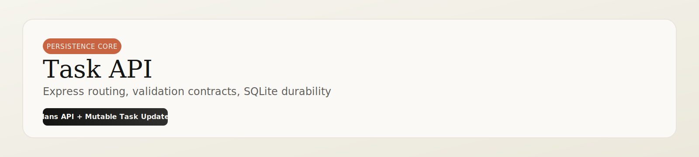

<p align="center">
  
</p>

<p align="center">
  
  
  
</p>

<p align="center">
  <a href="#quick-start">Quick Start</a> ·
  <a href="#request-flow-clean-ascii">Flow</a> ·
  <a href="#endpoints">Endpoints</a> ·
  <a href="#example-requests">Examples</a>
</p>

---

The Task API is the persistence backbone: it stores plans, enforces task update contracts, and serves plan/task state over REST.

## Service Snapshot

| Focus | Outcome |
|---|---|
| Durable writes | Plans and tasks survive across sessions |
| Safe updates | Mutable field validation on task edits |
| Predictable reads | Stable plan/task response contracts |

## Request Flow (Clean ASCII)

```text
┌───────────────────┐      ┌───────────────────┐      ┌───────────────────┐
│ Client / AI Layer │ ---> │ Express Routes    │ ---> │ Controllers       │
└───────────────────┘      └─────────┬─────────┘      └─────────┬─────────┘
                                      │                          │
                                      ▼                          ▼
                              ┌───────────────────┐      ┌───────────────────┐
                              │ Repository Layer  │ ---> │ SQLite planner.db │
                              │ transaction-safe  │ <--- │ WAL + FKs enabled │
                              └───────────────────┘      └───────────────────┘
```

## Endpoints

| Method | Endpoint | Purpose |
|---|---|---|
| `POST` | `/api/plans` | Persist generated or reviewed plan |
| `GET` | `/api/plans/:id` | Retrieve one plan with task graph |
| `DELETE` | `/api/plans/:id` | Delete one plan and cascade tasks |
| `PATCH` | `/api/tasks/:id` | Update mutable task fields |
| `GET` | `/health` | Health check |

## PATCH /api/tasks/:id Accepted Fields

- `task_id`
- `title`
- `description`
- `estimated_hours`
- `priority`
- `status`
- `dependencies`
- `recommended_date`

## Environment Variables

Create local env file:

```powershell
Copy-Item .env.example .env
```

| Variable | Required | Description |
|---|---|---|
| `PORT` | No | API port, default `4000` |
| `DB_PATH` | No | SQLite file path, default `./data/planner.db` |
| `ALLOWED_ORIGINS` | No | Comma-separated browser CORS allowlist |
| `INTERNAL_API_TOKEN` | Yes (prod) | Shared token expected in `x-internal-api-token` |
| `JSON_BODY_LIMIT` | No | Request body size limit |
| `RATE_LIMIT_WINDOW_MS` | No | In-memory rate-limit window in ms |
| `RATE_LIMIT_MAX_REQUESTS` | No | Max requests per IP inside each window |

## Quick Start

From repository root:

```powershell
npm install --prefix task-api
npm run dev --prefix task-api
```

Production mode:

```powershell
npm run build --prefix task-api
npm run start --prefix task-api
```

## Example Requests

Create a plan:

```bash
curl -X POST http://localhost:4000/api/plans \
  -H "Content-Type: application/json" \
  -H "x-internal-api-token: <internal_token>" \
  -d '{"goal":"Goal: Ship MVP","tasks":[{"task_id":"T1","title":"Scope MVP"}]}'
```

Update a task:

```bash
curl -X PATCH http://localhost:4000/api/tasks/<task_id> \
  -H "Content-Type: application/json" \
  -H "x-internal-api-token: <internal_token>" \
  -d '{"status":"done"}'
```

## Key Files

- `src/index.ts`: server bootstrap and middleware wiring.
- `src/controllers/`: validation and response shaping.
- `src/db/`: schema, migrations, and repository logic.
- `src/types/index.ts`: shared API contracts.
